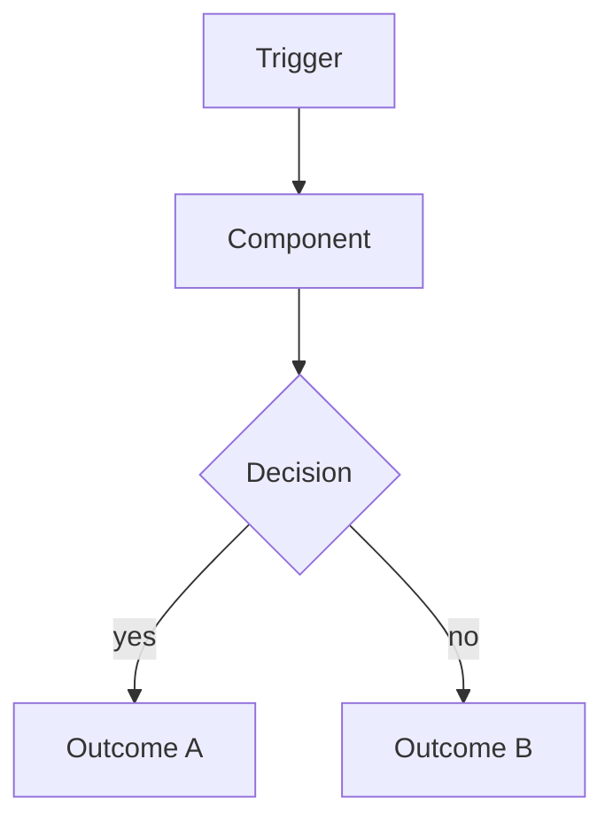
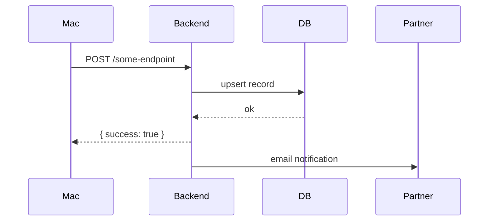

---
# PascalCase slug — used as the canonical identifier for this feature in check-docs.sh
feature: FeatureSlug
# design | wip | shipping | deprecated
status: design
# Intentional Mac | Intentional Backend | Shared
owner: Intentional Mac
# ISO date — bump every time you verify the doc still matches the code
last_verified: 2026-05-21
# Relative paths from repo root. check-docs.sh errors if a listed file doesn't exist.
# Append :LINE for a specific line anchor (e.g. Intentional/Foo.swift:42)
files:
  - Intentional/Example.swift
  - intentional-backend/main.py:100
# Slugs of related feature docs (must match other files' `feature:` frontmatter)
related:
  - other-feature-slug
---

## TL;DR

<!-- One sentence. What does this feature do, in plain English? Example:
     "On-device screen scan for nudity; flagged frames POST to backend; partner notified via batched email." -->

## User-visible behavior

<!-- Bullet list covering the feature from the user's perspective. Cover:
     - When it activates / what triggers it
     - What the user sees on screen (overlays, toasts, pill changes)
     - What the accountability partner sees (emails, dashboard entries)
     - How the user can interact with it (dismiss, configure, disable — or can't) -->

- Item 1
- Item 2

## Architecture

<!-- Mermaid flowchart or graph showing the major components and their relationships.
     Use `flowchart TD` for top-down, `flowchart LR` for left-to-right.
     Keep nodes short — use IDs for long names.
     Example: -->

## Data flow

<!-- Mermaid sequenceDiagram showing the request/response or event flow between
     the major actors (Mac app, Backend, DB, external services, Partner).
     Include the happy path and at least one error branch. -->

## Files

<!-- Markdown table. Every row must correspond to a file listed in frontmatter `files:`.
     Role column: one phrase describing what this file is responsible for. -->

| File | Lines | Role |
|------|-------|------|
| `Intentional/Example.swift` | ~200 | Core logic |
| `intentional-backend/main.py` | L100–150 | API route |

## Key functions

<!-- Markdown table. List the 4-8 most important functions/methods that implement this feature.
     "Called by" should name the caller one level up — not the full call chain. -->

| Function | What it does | Called by |
|----------|-------------|-----------|
| `start()` | Begins polling | `AppDelegate.applicationDidFinishLaunching` |
| `pollAndAnalyze()` | Core detection loop | poll timer |

## Configuration

<!-- Env vars, UserDefaults keys, build flags, and their defaults.
     Include both Mac-side and backend-side config. -->

| Key | Where | Default | Notes |
|-----|-------|---------|-------|
| `exampleKey` | UserDefaults (Mac) | `false` | Toggle for X |
| `EXAMPLE_ENV` | Env var (Backend) | unset | Controls Y |

## Edge cases & limitations

<!-- Known failure modes, deliberate trade-offs, and non-obvious behaviors.
     Each bullet should state WHAT can go wrong and WHY it happens (or was accepted). -->

- **Known issue**: ...
- **Trade-off**: ...
- **macOS version caveat**: ...

## Decision history

<!-- Dated bullets in reverse-chronological order. Each bullet: date + decision + rationale.
     This is the "why did we build it this way" log. -->

- **2026-05-21** — Initial spec written.
- **2026-04-22** — Decision X because reason Y.
