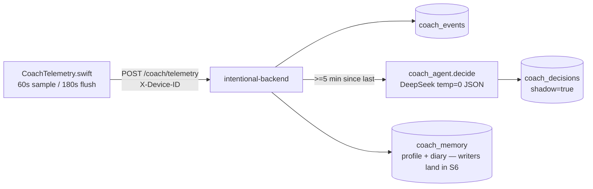

## TL;DR

A cloud "coach" agent (DeepSeek, on intentional-backend) reasons over abstracted Mac activity every ~5 minutes and decides silence/credit/nudge/rescue/celebrate — currently in **shadow mode**: every verdict is logged, nothing is ever shown. Visibility (S3) is gated on the eval bench's zero wrong-speak requirement, which the tuned charter passes 50/50.

## User-visible behavior

- **None, by design (S2 = shadow).** The Mac samples frontmost app + browser host + session/allowance state every 60s and batch-posts every 180s; boundary events (session start/end) flush immediately.
- **Screen descriptions (default tier, 2026-06-12):** out-of-session, the Mac emits ONE locally-generated sentence about what's on screen as a separate `description` event `{app, host?, description, engine}`. Primary pipeline (2026-06-12 VLM swap): ScreenCapture → downscale ≤1440px → **Qwen3-VL-4B-Instruct-4bit vision model** with the bench-winning v2_catfirst prompt (`Intentional/VLMDescriber.swift`; `engine: "vlm:<model>"`); fallback while the VLM downloads / on load failure / on degenerate output after one retry: Vision OCR → Qwen3-4B text (`engine: "ocr-text"`). Why: OCR+text scored 23% categories (0/11 on entertainment shots) vs 90–100% for the VLM prompts (`vlm_bench/RESULTS.md`). Never in-session, never racing scoring (skip-not-queue via `isInferenceBusy`, scoring priority), single-flight. Triggers: 60s sample timer (60s min-gap floor) **plus app-switch** — `NSWorkspace.didActivateApplicationNotification` on a different bundle id than the last described one, 2s settle delay, 15s min-gap.
- Privacy gate: UserDefaults `coachTelemetryLevel` — `"descriptions"` (default: names + titles + on-device screen descriptions) | `"titles"` | `"names"` | `"off"`. Only the generated sentence leaves the device; raw OCR text and screenshots never do.
- Shadow verdicts are reviewable at `GET /coach/decisions` (dual-auth) — this becomes the "what your coach can see" transparency surface later.

## Architecture



## Data flow

```mermaid
sequenceDiagram
    participant Mac
    participant API as /coach/telemetry
    participant LLM as DeepSeek
    Mac->>API: events batch (names+minutes)
    API->>API: store; throttle check (300s)
    API->>LLM: charter + profile + diary + today log + fresh obs
    LLM-->>API: {"action":"silence","why":"..."}
    API->>API: code-level caps; insert coach_decisions (shadow)
    Note over Mac,API: failure path: flush 404/network → events re-queue on Mac (400-event ring)
```

## Files

| File | Lines | Role |
|------|-------|------|
| `Intentional/CoachTelemetry.swift` | ~150 | Sampler, privacy gate, buffer, batched flush + re-queue |
| `Intentional/BackendClient.swift` | postCoachTelemetry | Authenticated batch POST |
| `Intentional/AppDelegate.swift` | ~692, fanout | Wiring + session boundary events |

Backend (intentional-backend): `coach_prompts.py` (charter), `coach_agent.py` (decide/caps/fail-closed), `main.py` /coach endpoints, `migrations/029_coach_agent.sql`, `coach_bench/` (50-scenario eval + results).

## Key functions

| Function | What it does | Called by |
|----------|-------------|-----------|
| `CoachTelemetry.sample()` | 60s snapshot: app/host/in_session/allowance; kicks off description | sample timer |
| `CoachTelemetry.maybeDescribeScreen(minGap:)` | fire-and-forget `description` event; tier + session + throttle (60s timer / 15s app-switch) + single-flight gates | sample(), handleAppActivation() |
| `CoachTelemetry.handleAppActivation()` | app-switch trigger: different bundle id than last described → 2s settle timer → describe | NSWorkspace didActivateApplication |
| `RelevanceScorer.describeScreenForTelemetry()` | capture → VLM describe (primary) or OCR (600ch) → Qwen text one-shot (fallback) → ("sentence [category]", engine) | CoachTelemetry |
| `VLMDescriber.describe(image:)` | downscale ≤1440px → Qwen3-VL one-shot (v2_catfirst, temp 0, ≤80 tok); bare-category/<15-char guard with one retry | RelevanceScorer |
| `VLMDescriber.startLoadingIfNeeded()` | fire-and-forget lazy download+load to ~/Library/Caches/models (single-flight; failure = permanent ocr-text fallback this run) | RelevanceScorer |
| `CoachTelemetry.flush()` | batch POST; re-queue on failure | flush timer + boundaries |
| `coach_agent.decide()` (py) | one reasoning pass; never raises; fail-closed to silence | /coach/telemetry |
| `caps_from_decisions` (py) | code-level daily caps (nudge 3, rescue 2, celebrate 1, credit 2) | decide path |
| `run_bench.py` | 50 scenarios; wrong-speak gate for S3 | manual / CI later |

## Configuration

| Key | Where | Default | Notes |
|-----|-------|---------|-------|
| `coachTelemetryLevel` | UserDefaults (Mac) | `"descriptions"` | tiers: descriptions / titles / names / off |
| `DEEPSEEK_API_KEY` / `DEEPSEEK_MODEL` | Railway env | — / `deepseek-chat` | reasoner scored worse (token-cap truncation) |
| Throttle / caps | code | 300s; 3/2/1/2 per day | guardrails in code, not prompt |

## Edge cases & limitations

- **Shadow only** — no UI exists; S3 (first visible nudge) is a separate plan, gated on bench wrong-speak = 0 (PASSED 2026-06-12, charter `fcdf967`).
- Bench gray zone: credit threshold is "20+ steady minutes"; 12–21 min behavior unverified (no scenarios there yet).
- `week_summary` is empty in S2 (weekly-pace context wires in with the morning ritual, S6); `coach_memory` tables exist but writers land in S6.
- Backend down → events ring-buffer caps at 400 (~6.5h); oldest drop first.

## Decision history

- **2026-06-12** — VLM swap: screen descriptions now run on `mlx-community/Qwen3-VL-4B-Instruct-4bit` (MLXVLM, lazy-downloaded) with the v2_catfirst prompt from `vlm_bench/RESULTS.md`; OCR+text kept as fallback; payload gains `engine`; app-switch trigger added (15s min-gap, 2s settle). Rung 2 of the feasibility ladder — the pinned mlx-swift-lm (a3e1bf4) has no qwen3_5 vision support, so the tuned-prompt Qwen3.5 winner isn't loadable in-app; Qwen3-VL was the Round-1 winner (90% cat / 1.93 desc / 0 halluc).
- **2026-06-12** — Screen-understanding layer: `description` telemetry events (one on-device OCR+Qwen sentence per 60s, out-of-session only; new default privacy tier `"descriptions"`). Backend renders them as `{t} >> {description}` in `compact_today_log`; requires migration 030 (kind CHECK). Bridge until a VLM replaces capture→understand.
- **2026-06-12** — S1+S2 shipped + verified live: first real shadow verdict at 09:00 ("silence — user switching iTerm2/Chrome, no commitment exists, silence is safest", 953 tokens, ~0.02¢). Charter tuned 86%→100% / wrong-speak 7→0 in 3 bench iterations. Spec: `docs/superpowers/specs/2026-06-12-focus-agent-design.md`. Plan: `docs/superpowers/plans/2026-06-12-focus-agent-s1-s2.md`.
- **2026-06-12** — Design locked: local senses / cloud brain, silence-biased, constitution (can't touch rules/strict-mode/allowance), 13-tool roadmap, phone tools deferred.
