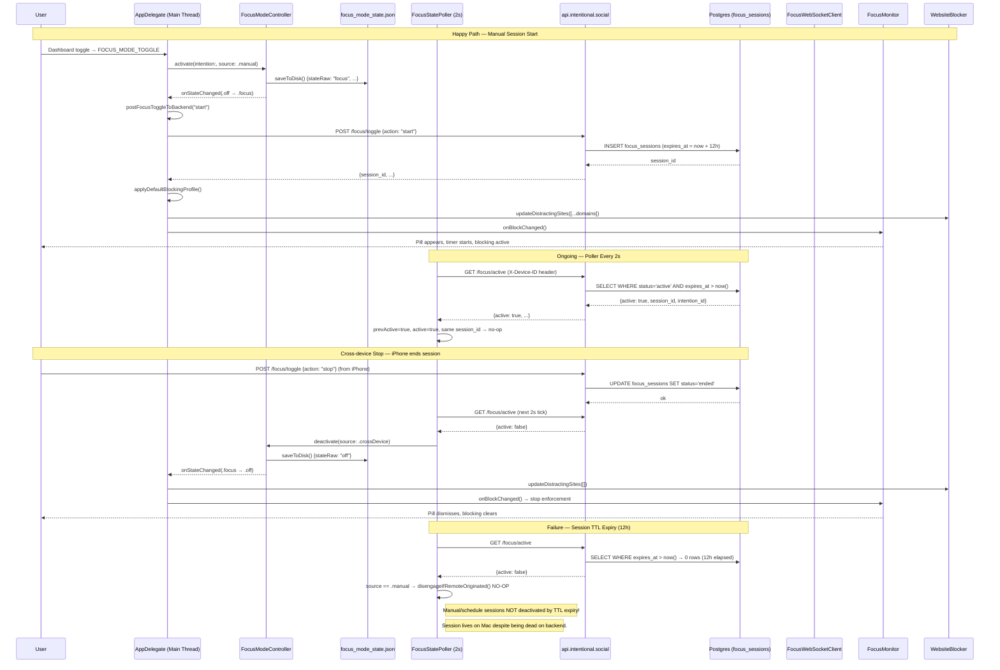

## TL;DR

`FocusModeController` is the single boolean gate for "is the Mac enforcing right now." Three state values (OFF / FOCUS / BEDTIME), persisted to disk on every transition, reconciled against the backend's `focus_sessions` table every 2s via `FocusStatePoller`. All downstream enforcement (blocklists, overlays, nudges, AI scoring) subscribes to a single `onStateChanged` callback.

---

## User-visible behavior

- **Starting a session (manual):** The user taps the dashboard toggle, presses Cmd+Shift+P, or selects an Intention from the focus picker overlay. The pill widget appears in the top-right corner showing the active Intention name and a countdown timer. Website and app blocking engage immediately.
- **Starting a session (scheduled):** At the scheduled block start time, `ScheduleManager`'s 10s timer fires `onBlockChanged` → `.focus`. The start ritual appears inside the pill (`DeepWorkTimerController` `.startRitual` mode — "Up next" card with Start/Edit; auto-starts after 3 min for work blocks, 30s for free time). After Start, the pill timer begins. (The legacy full-screen `BlockRitualController` was deleted 2026-06-10.)
- **Starting a session (cross-device):** The user starts a session on iPhone. The Mac's WebSocket client and `FocusStatePoller` both detect the transition (whichever fires first); the Mac auto-engages without requiring any user click.
- **During a session:** The pill shows a red/green/indigo dot based on relevance of the current app or browser tab. Distracting sites are blocked via AppleScript tab control (`WebsiteBlocker`). Distracting native apps trigger nudges, the red-shift screen tint (`RedShiftController`), auto-redirect, or a mandatory intervention overlay depending on cumulative distraction seconds and block intensity.
- **Ending a session (manual):** The user clicks the dashboard toggle or the pill "Stop" button. The end-of-block ritual overlay appears (celebration carousel with focus score, app breakdown, and earned minutes). Blocking disengages.
- **Ending a session (scheduled):** The block end time fires `onBlockChanged` → `.off`. Celebration auto-triggers.
- **App restart mid-session:** `FocusModeController` reads disk state on `init()`. If the session was active when the app was killed, enforcement re-engages within ~50ms of launch (before the first poller tick). The poller reconciles against backend within 2s.
- **Session loss symptom (the bug we're hunting):** The user believes a session is active (pill is visible, timer running) but enforcement has silently stopped — blocked sites load, the AI scorer is idle, and the pill shows the correct intention name but the blocking overlay no longer fires. This suggests `FocusModeController.state` is `.focus` in the UI layer but the enforcement fanout did not run or ran once and was not re-triggered.

---

## Architecture

```mermaid
flowchart TD
    subgraph Sources["Activation Sources"]
        MANUAL[Manual toggle / Cmd+Shift+P]
        SCHED[ScheduleManager 10s tick]
        POLLER[FocusStatePoller 2s poll]
        WS[FocusWebSocketClient]
        PUCK[Puck / iPhone NFC]
    end

    subgraph Controller["FocusModeController (single source of truth)"]
        STATE[state: off / focus / bedtime]
        PERIOD[currentPeriod: id, startedAt, intention, source]
        DISK[(focus_mode_state.json)]
        CB[onStateChanged callback]
    end

    subgraph Fanout["onStateChanged Fanout (AppDelegate wiring)"]
        CACHE[RelevanceScorer.clearCache]
        EARNED[EarnedBrowseManager.onBlockChanged]
        FM[FocusMonitor.onBlockChanged]
        BLOCK[applyDefaultBlockingProfile]
        SWEEP[runCloseTheNoiseSweep]
        DASH[MainWindow.pushFocusModeUpdate]
        SWITCH[SwitchCoordinator.reset  (on .off)]
    end

    subgraph Backend["Backend"]
        API["/focus/active  GET (2s)"]
        TOGGLE["/focus/toggle  POST"]
        DB[(focus_sessions table\nexpires_at = started_at + 12h)]
    end

    MANUAL --> STATE
    SCHED --> STATE
    POLLER --> STATE
    WS --> STATE
    PUCK --> STATE

    STATE --> DISK
    STATE --> CB
    CB --> CACHE
    CB --> EARNED
    CB --> FM
    CB --> BLOCK
    CB --> SWEEP
    CB --> DASH
    CB --> SWITCH

    POLLER --> API
    API --> DB
    STATE -- "locally originated (manual/schedule)" --> TOGGLE
    TOGGLE --> DB
```

### State persistence + boot reconcile

**Where state is written:**
`~/Library/Application Support/Intentional/focus_mode_state.json`

Format (schemaVersion=2):
```json
{
  "schemaVersion": 2,
  "stateRaw": "focus",
  "periodId": "3E4F8A21-...",
  "periodStartedAt": "2026-05-21T09:03:00Z",
  "periodIntention": "Deep Work — API refactor",
  "periodIntentionId": "7B2A1C...",
  "periodSourceRaw": "schedule"
}
```

**When state is written:**
`saveToDisk()` is called inside `notify()` (line 247 of `FocusModeController.swift`) **synchronously** before the `DispatchQueue.main.async` fanout. This means the disk write completes even if the process is killed during the async fanout. The write uses `.atomic` option — either the full new state lands or the old state is preserved; no half-writes.

**How state is loaded on launch:**
`loadFromDisk()` runs in `FocusModeController.init()` (line 73). If the file exists and parses cleanly and `restoredState != .off`, the controller's `state` and `currentPeriod` are set in-memory immediately. No callback fires — it is a silent state restore. `onStateChanged` is not yet wired at this point (happens at AppDelegate step 15.5).

**The boot reconcile gap (critical for the bug hunt):**
At AppDelegate line 893, after `blockingProfileManager` is initialized:
```swift
if focusModeController?.state == .focus {
    applyDefaultBlockingProfile()
    focusMonitor?.onBlockChanged()
}
```
This manually re-fires the two most critical enforcement side-effects. However, it does NOT call `onStateChanged` — so anything wired exclusively to that callback (close-the-noise sweep, `SwitchCoordinator.reset`, `earnedBrowseManager.onBlockChanged`, `mainWindowController?.pushFocusModeUpdate`) does **not** run on restart.

Specifically, the close-the-noise sweep (`runCloseTheNoiseSweep`) requires a `.off → .focus` transition to fire. On app restart with `.focus` already loaded from disk, the state is never `.off`, so the sweep never fires. Whether this matters for session loss depends on whether the sweep's absence prevents any enforcement-critical path.

**Backend reconciliation (the override):**
`FocusStatePoller` starts after the boot reconcile (AppDelegate line 1005–1021). Within 2s, it calls `/focus/active`. If the backend says `active=false` (e.g., session expired its 12h TTL, or was stopped on another device), `applyTransition` calls `disengageIfRemoteOriginated()`. This only deactivates if `currentPeriod.source == .puck || .crossDevice`. If the session was started by `.schedule` or `.manual`, the poller does **not** deactivate — the session persists locally even if the backend expired it.

---

## Data flow



---

## Files

| File | Lines | Role |
|------|-------|------|
| `Intentional/FocusModeController.swift` | ~264 | State machine (OFF/FOCUS/BEDTIME), disk persistence, `onStateChanged` callback, schedule-guard on deactivation |
| `Intentional/FocusStatePoller.swift` | ~185 | Polls `/focus/active` every 2s; drives `FocusModeController` activate/deactivate; ignores puck-triggered sessions per May 2026 product scope |
| `Intentional/FocusMonitor.swift` | ~4194 | Desktop enforcement: app/tab scoring, distraction counter, nudges, overlays, interventions, rituals, celebration. Reads `focusModeController.isOn`. |
| `Intentional/ScheduleManager.swift` | ~800+ | Manages daily schedule (`daily_schedule.json`), 10s block-check timer, `onBlockChanged` callback routing into `FocusModeController` |
| `Intentional/AppDelegate.swift` | ~2478 | Wires all components, hosts `focusModeController.onStateChanged` fanout callback (line 720), boot reconcile (line 893), initial block sync (line 1103) |
| `Intentional/BlockEndRitualController.swift` | ~400 | Full-screen end-of-block celebration carousel (focus score, app breakdown, up-next block) |

---

## Key functions

| Function | File | Line (approx) | What it does | Called by |
|----------|------|---------------|-------------|-----------|
| `FocusModeController.activate(intention:intentionId:source:)` | `FocusModeController.swift` | L169 | Transitions to `.focus`; idempotent on same state (updates metadata); fires `notify()` | `AppDelegate.startFocusSession`, `FocusStatePoller.engage`, `ScheduleManager.onBlockChanged`, `FocusWebSocketClient.onFocusSignal` |
| `FocusModeController.deactivate(source:)` | `FocusModeController.swift` | L221 | Transitions to `.off`; guards against `.schedule` deactivation when backend session is still active | `AppDelegate.endFocusSession`, `FocusStatePoller.disengageIfRemoteOriginated`, `ScheduleManager.onBlockChanged` |
| `FocusModeController.notify(old:new:period:)` | `FocusModeController.swift` | L243 | `saveToDisk()` then `DispatchQueue.main.async { onStateChanged(...); NotificationCenter post }` | `activate`, `deactivate`, `activateBedtime` |
| `FocusModeController.loadFromDisk()` | `FocusModeController.swift` | L125 | Reads `focus_mode_state.json`, sets `state` + `currentPeriod` without firing callback | `FocusModeController.init()` |
| `FocusStatePoller.poll()` | `FocusStatePoller.swift` | L59 | `async` — GET `/focus/active`, calls `applyTransition` on `MainActor` | 2s `Timer` (`.common` RunLoop mode) |
| `FocusStatePoller.applyTransition(active:sessionId:triggeredBy:intentionId:)` | `FocusStatePoller.swift` | L114 | Detects START / STOP / SESSION_CHANGE transitions; ignores `triggeredBy == "puck"` | `poll()` (on `MainActor`) |
| `FocusStatePoller.disengageIfRemoteOriginated()` | `FocusStatePoller.swift` | L177 | Only deactivates if `currentPeriod.source == .puck || .crossDevice`; manual/schedule sessions are not killed by backend stop | `applyTransition` on STOP detected |
| `AppDelegate.onStateChanged` (closure) | `AppDelegate.swift` | L720 | The master fanout: clears cache, injects synthetic block, fans out to earnedBrowse, focusMonitor, applies blocklist, runs sweep, pushes dashboard update | `FocusModeController.notify()` |
| `AppDelegate.postFocusToggleToBackend(action:)` | `AppDelegate.swift` | L1753 | Fire-and-forget POST `/focus/toggle` with `X-Device-ID`. No retry — next poller tick reconciles on failure | `onStateChanged` (for locally-originated transitions only) |
| `AppDelegate.applyDefaultBlockingProfile()` | `AppDelegate.swift` | L1778 | Reads `blockingProfileManager.profiles.first(where: { $0.isDefault })`, pushes domains + bundleIds to `WebsiteBlocker` and `FocusMonitor` | `onStateChanged` on enter-`.focus`; boot reconcile at line 895 |
| `ScheduleManager.recalculateState(forceCallback:)` | `ScheduleManager.swift` | ~L700 | Computes `currentBlock` + `currentTimeState` from clock; fires `onBlockChanged` only on change (or if `forceCallback`) | 10s block-check timer; `pullFromBackend`; `injectFocusSessionBlock` |
| `FocusMonitor.onBlockChanged()` | `FocusMonitor.swift` | ~L500 | Re-evaluates current app/tab, starts or stops enforcement, shows/dismisses start ritual | `AppDelegate.onStateChanged`; boot reconcile |
| `AppDelegate.checkForActiveFocusSession()` | `AppDelegate.swift` | L2247 | Called when WebSocket connects; pulls `/focus/active` and re-engages session if active. Fallback for the window between app start and first poller tick. | `FocusWebSocketClient.onConnectionStateChanged` |

---

## Configuration

| Key | Where | Default | Notes |
|-----|-------|---------|-------|
| `focus_mode_state.json` | `~/Library/Application Support/Intentional/` | `{stateRaw: "off"}` | Persisted state. `schemaVersion=2` adds `periodIntentionId`. v1 blobs decode cleanly (new field is optional). |
| `FOCUS_SESSION_TTL_HOURS` | `intentional-backend/main.py` line 114 | `12` | Hours before backend auto-expires a session with no stop. `/focus/active` filters on `expires_at > now()`. |
| `FocusStatePoller.interval` | `FocusStatePoller.swift` line 22 | `2.0s` | Poll cadence. Timer uses `.tolerance = 0.5` and `.common` RunLoop mode. |
| `ScheduleManager.blockCheckTimer` | `ScheduleManager.swift` | 10s interval | Drives block transitions from local schedule. Not reset on `/time_blocks` pull — always running. |
| `focus_mode_v1_migration_complete` | `UserDefaults` | `false` → set on first run | One-shot migration wipe of `intentionalModeEnabled` + stale `.json` files from deleted controllers. |
| `strictModeEnabled` | `UserDefaults` | `false` | When true and no daemon, blocks `Cmd+Q`. When true with daemon, daemon relaunches after quit. |

---

## Edge cases & limitations

- **Backend TTL vs. local state divergence**: A session started manually on Mac persists locally even after the 12h TTL expires on backend. `disengageIfRemoteOriginated()` explicitly skips deactivation for `.manual` and `.schedule` sources. This is intentional — the user's local session is the authority for locally-started sessions. But it means a user who left a 13-hour session running unknowingly has an un-killable local session on Mac.

- **Schedule-sourced deactivation guard**: `FocusModeController.deactivate(source: .schedule)` is refused when `isBackendSessionActive() == true` (line 231). This is correct for Spec 1 sessions (manual via phone, not in `/time_blocks`). But if the backend session record is stale (stuck active after a crash), the schedule can never kill it locally — the user is stuck enforced until either: (a) the poller detects `active=false` (requires an explicit stop being posted somewhere), or (b) the session TTL expires (12h), but see above — TTL expiry only kills puck/crossDevice sessions, not manual ones.

- **Boot reconcile does not fire `onStateChanged`**: On app restart with `.focus` in disk state, enforcement is manually re-engaged via `applyDefaultBlockingProfile()` + `focusMonitor?.onBlockChanged()` (AppDelegate line 893–897). The `onStateChanged` callback does NOT fire. This means: close-the-noise sweep does not run, `earnedBrowseManager.onBlockChanged` does not run, `SwitchCoordinator` is not reset, and `MainWindow.pushFocusModeUpdate` does not fire. Dashboard state may show "off" until the user interacts with it or the next poller push.

- **Synthetic block injection race**: When `onStateChanged` fires for `.off → .focus` and `scheduleManager.currentBlock == nil`, a synthetic `FocusBlock` is injected at line 768. This synthetic block sets `endHour: 23, endMinute: 59`. If the schedule later pulls a real block from `/time_blocks`, `recalculateState()` will replace the synthetic block — but `onBlockChanged` fires again, potentially re-triggering enforcement with mismatched state.

- **Duplicate activation path for `startFocusSession`**: `startFocusSession` (line 1674) calls `focusModeController?.activate(...)` then `applyFocusSession(...)`. `applyFocusSession` also calls `scheduleManager?.injectFocusSessionBlock(block)` and `focusMonitor?.onBlockChanged()`. Separately, `onStateChanged` also calls `focusMonitor?.onBlockChanged()`. This means `focusMonitor.onBlockChanged()` is called TWICE on a manual session start: once from `applyFocusSession` and once from the `onStateChanged` fanout. The ritual guard (`lastRitualShownForBlockId`) prevents the start ritual from showing twice, but the double-call is an opportunity for race conditions.

- **No immediate poll after wake**: `SleepWakeMonitor.computerDidWake()` does not force an immediate `/focus/active` poll. The next natural timer tick (up to 2s) is the earliest the Mac's local state syncs with backend after wake. If the Mac wakes into a network-offline state and the session TTL expired during sleep, the local state remains `.focus` for an indeterminate period.

- **`postFocusToggleToBackend` has no retry**: The `URLSession.dataTask` in `postFocusToggleToBackend` (line 1762) logs errors but does NOT retry. A transient network failure means the session is not registered on the backend. The poller will detect `active: false` on its next tick (up to 2s) and — depending on the source — may deactivate the local session. For `.schedule` and `.manual` sessions, the poller does not deactivate (source guard), so the Mac stays enforced but the backend has no record. iPhone will see no active session and not enforce. This is the divergence bug described in `cross-repo-focus-sync-2026-04-28.md`.

- **Dashboard state after boot-reconcile**: Because `onStateChanged` does not fire on boot reconcile, `mainWindowController?.pushFocusModeUpdate(state:)` does not run. The dashboard (WKWebView) loads with a stale state until either (a) the user opens it and `GET_FOCUS_MODE` is called, or (b) the next `onStateChanged` transition fires. If the user opens the dashboard before that, they may see a "Focus off" UI while enforcement is active.

- **WS and Poller race on session start**: Both `FocusWebSocketClient.onFocusSignal` and `FocusStatePoller.applyTransition` can call `focusModeController.activate(...)` for the same event. `activate` is idempotent on same state/source — if the session_id is the same, the second call is a no-op. If session IDs differ (e.g., WS fires with session_id=A while poller fires 200ms later with session_id=B because the backend created a second session), the poller's `applyTransition` detects `active && prevActive && sessionId != prevSessionId` (line 137) and calls `engage(...)` again — which re-fires `activate(...)` and thus `onStateChanged`. The enforcement fanout runs twice.

- **`triggeredBy == "puck"` sessions are ignored on Mac**: Per the May 2026 product scope, puck-triggered focus sessions on the backend are explicitly ignored by the Mac client (FocusStatePoller line 126–129). The backend session row exists; Mac does not engage enforcement. This means if a user expects puck to trigger Mac blocking, it won't — this is a documented product decision, not a bug. It will cause confusion if the user tests by starting a session on iPhone with puck mode and expects Mac to enforce.

- **Sleep/wake does not restart the poller**: `SleepWakeMonitor.computerDidWake()` calls `contentSafetyMonitor.onWake()` and the `onWake` callback (which drives `bedtimeEnforcer.onMacWoke()`). It does NOT restart `FocusStatePoller` or check `/focus/active` immediately after wake. The existing 2s timer will fire naturally after the RunLoop resumes, but there is a window of up to 2s where the Mac's local state and backend may be out of sync after wake — plus the time it takes the network to reconnect. In practice, the first poll fires within 2–5s of wake.

- **ScheduleManager pulls `/time_blocks` every 60s, poller polls every 2s**: These two clocks are not synchronized. A block transition from the schedule fires `onBlockChanged`, which calls `focusModeController.activate(source: .schedule)`. Meanwhile, the poller may be mid-flight calling `/focus/active`. Both run on the main thread (poller via `await MainActor.run`, schedule via the main queue timer), so they don't race at the Swift level — but the ordering of two `MainActor.run` calls dispatched within the same 2s window is non-deterministic. If the schedule fires `.off` (block ended) while the poller fires `.focus` (backend still active), the poller wins if it runs last.

---

## Failure modes table

This table is the core artifact for the session-loss bug hunt. Each row represents a distinct failure path that could cause the Mac to stop enforcing while the user believes a session is active. Rows marked **HIGH** are the most likely culprits and should be instrumented first.

| Failure mode | Trigger | Detection | What the user sees | Hypothesis for "session loss" |
|---|---|---|---|---|
| **Backend TTL expires (12h)** | Session started > 12h ago and no stop was posted | `/focus/active` returns `active: false`; poller calls `disengageIfRemoteOriginated()` | Session ends silently if puck/crossDevice-sourced. Nothing if manual/schedule. | UNLIKELY for manual sessions (guard refuses). POSSIBLE for puck-sourced sessions where user expected Mac to stay enforced. |
| **Poller misidentifies source on session restore** | App restarts mid-session; disk state says `.manual`, but poller sees `triggered_by: "puck"` on the backend row | — | Poller's `engage()` re-activates with `source: .crossDevice`; now the source is `.crossDevice` not `.manual`. A subsequent backend stop or TTL expiry WILL deactivate the session via `disengageIfRemoteOriginated()`. | POSSIBLE — source mismatch after restart + TTL expiry is a real failure path. Disk says `.manual`; backend says `triggered_by: puck`; poller overwrites source to `.crossDevice`; TTL fires; session ends. |
| **Disk write failure** | Low disk space, permissions error, SIGKILL during `saveToDisk()` | Process-level; user would not see a crash | On restart, `loadFromDisk()` returns no state; controller starts `.off`; enforcement is not re-engaged | The `.atomic` write makes partial writes extremely rare, but SIGKILL between `saveToDisk()` return and `DispatchQueue.main.async` means the new state is on disk but `onStateChanged` never fired — no enforcement fanout ran for that transition. |
| **Schedule fires `.off` while poller is in-flight** | Block ends per local schedule at T+0; poller is checking backend at T+0.1; backend still says `active: true` | Both run on main thread so no mutex violation; ordering is non-deterministic | If schedule's `.off` runs first: `FocusModeController.deactivate(source: .schedule)` is called. The guard at line 231 checks `isBackendSessionActive()` which reads `lastKnownActive`. If the poller hasn't updated `lastKnownActive` yet, the guard passes and the session ends locally despite backend saying active. | PLAUSIBLE — this is the "schedule off wins before poller updates" race. `lastKnownActive` is stale for up to 2s after a backend state change. |
| **Cross-device session-id mismatch** | Mac has session_id=A in `lastKnownSessionId`; backend creates a new session B (user stopped and restarted on phone within 2s) | Poller detects `active && prevActive && sessionId != prevSessionId`; calls `engage()` again | `onStateChanged` fires again; close-the-noise sweep re-runs; blocklist re-applied. User may see a second sweep toast. | LOW — the fanout is additive, not destructive. The old session just gets overwritten. Could cause UX confusion but not session loss. |
| **App quits mid-session, dock-launch without state restored** | User force-quits app while session is active; `onWake`/dock click opens a fresh instance | `loadFromDisk()` should catch this — but if the app was killed before `saveToDisk()` completed... | If disk state is `.off` (SIGKILL before write), the boot reconcile gate at line 893 doesn't fire. Enforcement is not re-engaged until the poller's first tick at ~2s post-launch, if backend says active. | POSSIBLE if source is `.crossDevice` or `.puck`. For `.manual`/`.schedule`, the poller won't re-engage (it only activates; it won't flip a dead-state Mac back to enforcing by design). Actually: `poll()` → `applyTransition()` → `engage()` → `activate(source: .crossDevice)` DOES fire. So a killed `.manual` session would be re-activated as `.crossDevice` on the next tick. |
| **Watchdog SIGKILL during transition** | Strict-mode watchdog kills and relaunches app mid `onStateChanged` fanout | — | On relaunch, the new state was written to disk before the fanout. The boot reconcile re-engages enforcement. The fanout's mid-stream work (close-the-noise sweep, push dashboard) is lost. | LOW — the disk-write-before-fanout design protects state; only transient fanout effects are lost. |
| **ScheduleManager fires `.off` between contiguous blocks** | Two blocks are adjacent (block A ends at 12:00, block B starts at 12:00); the 10s timer fires `.off` at 12:00:05 before it fires `.focus` at the next tick | `recalculateState()` computes the state from clock at each tick | A 10-second gap between adjacent blocks where enforcement is briefly off. If the user is on a distracting site during this 10s, the blocker has no session to enforce. | MEDIUM — this is a known behavior of the 10s tick resolution. Back-to-back blocks with 0-second gap can still produce a momentary `.off` if the timer fires at exactly the boundary. |
| **`FocusWebSocketClient` JWT expiry + failed refresh** | JWT expires (15-min TTL); `onAuthExpired` fires; `authRefresh()` fails (e.g., Supabase session revoked) | WS permanently disconnected; no cross-device start/stop signals arrive | Cross-device session starts/stops are not picked up by WS. Poller still runs, so backend-side events still propagate within 2s via polling. | MEDIUM — WS being dead is fine as long as poller works. Risk only if BOTH WS and network fail simultaneously. |
| **`postFocusToggleToBackend` fails silently (network error)** | Mac is offline when user manually starts a session; fire-and-forget POST returns error | Error is logged but not retried; backend has no record of the session | Poller next tick: `/focus/active` returns `active: false`; for `.manual` source the poller does not deactivate — enforcement continues locally but backend and other devices have no session record | HIGH — this is the primary mechanism for the "Mac is enforcing but iPhone shows no session" divergence bug. Manual start with offline POST = permanent local-only session. |
| **`FocusWebSocketClient` JWT expiry + failed refresh** | JWT expires (15-min TTL); `onAuthExpired` fires; `authRefresh()` fails (e.g., Supabase session revoked) | WS permanently disconnected; no cross-device start/stop signals arrive | Cross-device session starts/stops are not picked up. Poller still runs, so backend-side events still propagate within 2s. | MEDIUM — WS being dead is fine as long as poller works. The risk is if BOTH fail (network partition + stale JWT). |
| **Sleep/wake: poller's Timer has not fired yet** | Mac wakes from sleep; network reconnects in 3s; Timer fires at T+4 | User activity log would show 4s gap | 4s window where Mac's enforcement is based on pre-sleep state. If backend stopped the session during sleep (TTL, iPhone stop), Mac enforces for those extra 4s. | LOW — 4s is negligible unless combined with another failure mode. |
| **`earnedBrowseManager.onBlockChanged` runs after `focusMonitor.onBlockChanged`** | Callback ordering bug: if something re-orders the AppDelegate fanout | — | `focusMonitor.recordWorkTick()` reads `activeBlockId` which is nil because `earnedBrowse.onBlockChanged` hasn't set it yet | LATENT — the code has a comment (AppDelegate line 786) explicitly preserving the order. But any future refactor that inlines or re-orders the fanout could re-introduce this. |

---

## Dead code candidates

### Confirmed deleted (April 2026 consolidation)

**`IntentionalModeController`** — Deleted in Task 9 of the focus consolidation plan (`docs/superpowers/plans/2026-04-27-focus-mode-consolidation.md`). Verification:
```bash
find Intentional/ -name "IntentionalModeController.swift"
# → no output (file is gone)
```
Remaining references are all comments or migration cleanup code in `AppDelegate.swift` (lines 331, 344, 357, 712) and `FocusModeController.swift` (line 6). These are documentation references, not stale callers. Status: **clean**.

**`FocusSessionManager`** — Deleted in the same consolidation. Same verification pattern. Remaining references are comments in `AppDelegate.swift` (lines 332, 357, 712) and `FocusModeController.swift` (line 6). Status: **clean**.

**`TimeState` 7-case enum** — Was `ScheduleManager.TimeState` with cases: `working`, `freeTime`, `unplanned`, `noPlan`, `betweenBlocks`, `prework`, `postwork` (or similar). Now consolidated to 3 cases: `.off`, `.focus`, `.bedtime` (ScheduleManager.swift line 258–266). Verification:
```bash
grep -rn "case unplanned\|case noPlan\|case freeTime\|case betweenBlocks\|case working\|case prework\|case postwork" Intentional/
# → no Swift hits (only HTML dashboard string "extraTimeState" which is a different variable)
```
Status: **clean**.

### Stale handlers still wired (not deleted — potential cleanup targets)

**`handleSaveIntentionalMode` in `MainWindow.swift` (line 1740):** The IntentionalMode UI was removed from the dashboard, but the Swift handler still exists and reads/writes `intentionalModeEnabled`, `intentionalModeSchedule`, `intentionalModeGracePeriod`, `intentionalModeCustomSchedule` UserDefaults keys. The dashboard still calls `handleSaveIntentionalMode` (via `saveAllSettings`), meaning the dead handler runs on every settings save and populates these keys. `MainWindow.swift` line 1156 also returns these keys in `GET_SETTINGS`. The handler is **not broken** (it's harmless), but it is dead product logic that could be removed. Flag for cleanup.

**`aiModel` setting persisted as `"apple"` default in `ScheduleManager.aiModel`:** The `ScheduleManager.swift` line 305 stores `aiModel: String = "apple"`. The CLAUDE.md and user memory both say the user uses Qwen3-4B, not Apple Foundation Models. The default `"apple"` will always fall through to Qwen unless explicitly changed. Worth auditing whether `RelevanceScorer` reads this field or uses its own logic.

**`FocusWebSocketClient` wired in parallel with `FocusStatePoller`:** Both drive `FocusModeController` for cross-device signals. The `cross-repo-focus-sync-2026-04-28.md` document explicitly notes WS removal as follow-up cleanup. The WS is still wired (AppDelegate line 929–994). It is not dead code — it still functions. But the polling path carries the load; WS adds JWT refresh complexity and reconnect fragility for marginal benefit.

### Potentially unreachable branches

**`FocusStatePoller.engage()` with `intentionId == nil` + `triggeredBy != "puck"`** (FocusStatePoller.swift line 163): When the backend session has no `intention_id` and was not triggered by puck, the fallback intention name is `"Focus session"`. This branch is currently reachable for any session started before Spec 1 (intentions backend) rolled out. As Spec 1 becomes universal, this will be dead code.

**`BlockingProfileManager.mergedBlockList` for `.isDefault`** (AppDelegate line 1780): `applyDefaultBlockingProfile()` calls `manager.profiles.first(where: { $0.isDefault })`. If no profile has `isDefault = true`, it falls through to `applyAlwaysActiveProfiles()`. The Spec 1 migration replaces profiles with Intentions; once that's complete, `applyDefaultBlockingProfile` will always fall through. This path will become unreachable.

---

## Decision history

- **2026-05-21** — Feature doc written as session-loss investigation artifact. Deep-read of all 7 source files. Documented the boot-reconcile gap, the schedule/poller race, the TTL-vs-manual-source interaction, and the handleSaveIntentionalMode dead handler.

- **2026-05-03** — Spec 1 (Intentions): `FocusModeController.Period` gained `intentionId: UUID?`. Schema version bumped to 2 in `PersistedState`. `FocusStatePoller.engage()` now resolves intention name from `IntentionStore` using `intention_id` from the backend session row.

- **2026-05-03** — Spec 1 (Intentions): Poller's `engage()` now resolves Intention name from `IntentionStore` via the `intention_id` on the backend session. `FocusModeController.Period` gained `intentionId: UUID?`. `PersistedState` schema bumped to v2.

- **2026-04-28** — `FocusStatePoller` created as primary cross-device signal path. Polling every 2s with `X-Device-ID` auth (no JWT expiry). Parallel to `FocusWebSocketClient`; both idempotent; WS remains wired. Backend gained `expires_at` TTL column on `focus_sessions` (migration 012). See `docs/cross-repo-focus-sync-2026-04-28.md`.

- **2026-04-27** — April 2026 consolidation: `IntentionalModeController` + `FocusSessionManager` deleted (~700 lines net). `FocusModeController` introduced with 3 states (OFF/FOCUS/BEDTIME). All enforcement paths now read `focusModeController.isOn` instead of inferring from `TimeState` / session presence. `ScheduleManager.TimeState` trimmed from 7 cases to 3. See `docs/FOCUS_CONCEPTS_SIMPLIFICATION.md` and `docs/superpowers/plans/2026-04-27-focus-mode-consolidation.md`.

- **2026-04-27** — `FocusModeController.deactivate(source: .schedule)` guard added to refuse schedule-sourced deactivations when backend session is still active. Prevents `ScheduleManager`'s 60s `/time_blocks` pull from killing Spec 1 manual sessions that don't appear in the schedule table.

- **2026-04-27** — Disk persistence added to `FocusModeController` (`loadFromDisk` / `saveToDisk`). State path `~/Library/Application Support/Intentional/focus_mode_state.json`. Atomic write. `saveToDisk` runs before `DispatchQueue.main.async` fanout to survive SIGKILL between write and callback dispatch. See Known Bug Fix #11 in `CLAUDE.md`.

- **Pre-2026-04-27** — `FocusSessionManager` held session state in a local `focus_session.json`. `IntentionalModeController` held "always-on" vs "scheduled" mode in UserDefaults. Nine overlapping state concepts caused recurring desync bugs (screen red without session, focus gate not engaging on cross-device). This was the motivation for the April 2026 consolidation.
