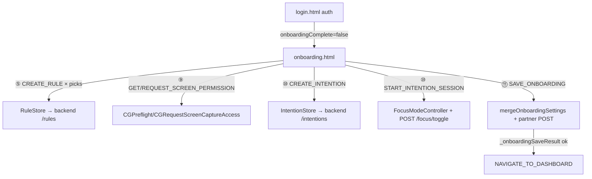
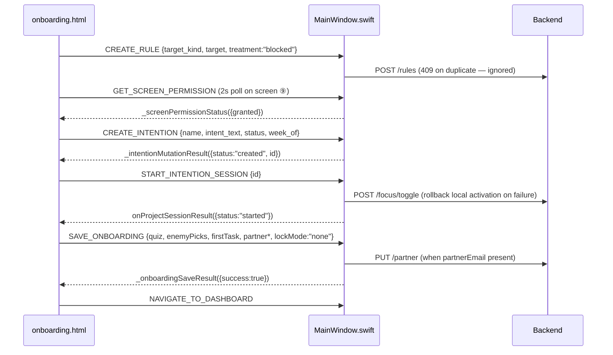

## TL;DR

Post-auth first-run wizard: 11 screens that mirror the user's pain (quiz), seed real blocking Rules from their picks, reveal the allowance deal, request screen permission just-in-time, start their first focus session *inside* onboarding, and only then ask for an accountability partner.

## User-visible behavior

- Shows once after first sign-in (`onboardingComplete` UserDefaults flag; until set, MainWindow routes login → onboarding instead of dashboard).
- Screen order: ① stat opener ("5 to 6 hours.") → ② mirror question (deleted-and-reinstalled) → ③ insight card ("You're not alone.") → ④ hours question → ⑤ name-the-enemy chip grid (TikTok/Instagram/YouTube/Reddit/X/Twitch/Netflix/Amazon + custom domain) → ⑥ shock math computed from the user's own hours answer → ⑦ the deal (allowance: 15 free min/day, 25 focused min earns 5) → ⑧ "This one you can't cheat." → ⑨ screen-permission ask with privacy promise (skippable) → ⑩ first session: type one task, session starts for real → ⑪ partner ask (post-win, skippable).
- Quiz taps auto-advance (~250ms). Thin coral progress bar on top; no dots, no back buttons.
- Screen ⑤ advance creates real 🚫 Rules for every pick (X seeds both x.com and twitter.com). Duplicates fail silently (backend 409).
- Screen ⑨ auto-advances with "✓ You're set" if/when screen recording is already granted (2s status poll while the screen is visible).
- Screen ⑩ creates a Weekly Goal (name + intent_text from the typed task, status in_progress, current ISO week) and starts a manual focus session on it — the user lands on the dashboard mid-session, never on an empty dashboard.
- All errors are inline text (WKWebView drops `alert()`/`confirm()`/`prompt()`).

## Architecture

## Data flow

## Files

| File | Lines | Role |
|------|-------|------|
| `Intentional/onboarding.html` | ~716 | All 11 screens, quiz state, bridge calls, approved copy |
| `Intentional/MainWindow.swift` | handler regions | SAVE_ONBOARDING merge-write, screen-permission bridge, routing (`loadCurrentPage`) |

## Key functions

| Function | What it does | Called by |
|----------|-------------|-----------|
| `goToScreen(n)` (JS) | Animated screen transition + enter/exit hooks | every advance |
| `seedRules()` (JS) | Fires CREATE_RULE per enemy pick | screen ⑤ Next |
| `startFirstSession()` (JS) | CREATE_INTENTION → START_INTENTION_SESSION chain | screen ⑩ CTA |
| `finish(withPartner)` (JS) | SAVE_ONBOARDING → NAVIGATE_TO_DASHBOARD | screen ⑪ both paths |
| `handleSaveOnboarding` (Swift) | UserDefaults + merge-write + partner POST | bridge |
| `mergeOnboardingSettings` (Swift) | Read-merge-write of onboarding_settings.json (preserves contentSafety.* keys) | handleSaveOnboarding |
| `emitScreenPermissionStatus` / `handleRequestScreenPermission` (Swift) | CGPreflight / CGRequest + Settings-pane fallback | bridge |

## Configuration

| Key | Where | Default | Notes |
|-----|-------|---------|-------|
| `onboardingComplete` | UserDefaults (Mac) | `false` | Set true by SAVE_ONBOARDING; gates onboarding vs dashboard routing |
| `lockMode` | UserDefaults (Mac) | `"none"` | Always "none" from the new flow (strictness dial owns commitment now) |
| `onboarding_settings.json` | App Support | — | Merge-written: quiz answers, enemyPicks, firstTask, partner fields, completedAt |

## Edge cases & limitations

- **Quit between screens ⑩ and ⑪**: session is running but `onboardingComplete` is false → onboarding re-shows on relaunch. Rule duplicates no-op; a second goal could be created. Accepted for v1.
- **Screen-recording grant may need app relaunch** to take effect for actual capture on macOS; status reporting is correct and RelevanceScorer degrades to metadata-only scoring meanwhile, so "Skip for now" and the granted-but-not-yet-active window are both honest states.
- **Chips must map to real domains** — "News"/"Shopping" were deliberately replaced with Netflix/Amazon so every promise the screen makes is enforceable.
- **Session is open-ended** — "25 minutes" is the suggested first rep (and matches the 5:1 allowance earn rate), not an enforced countdown.

## Decision history

- **2026-06-11** — Full rebuild (commits 253f93c, 97ab306, a143c77, e5c46f9). Replaced extension-era 5-screen wizard (theme picker, dead platform toggles, partner/lock before value) with value-before-commitment flow; copy cloned from Opal's voice + verbatim customer language; first session inside onboarding kills the empty-dashboard cliff. Cold-walk evidence: `docs/onboarding-coldwalk-2026-06-11.html`.
- **2026-06-11** — Partner ask moved post-win per Duolingo delayed-commitment evidence; lock screen deleted (strictness dial owns commitment stakes).
